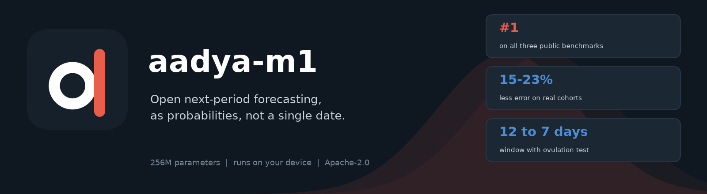
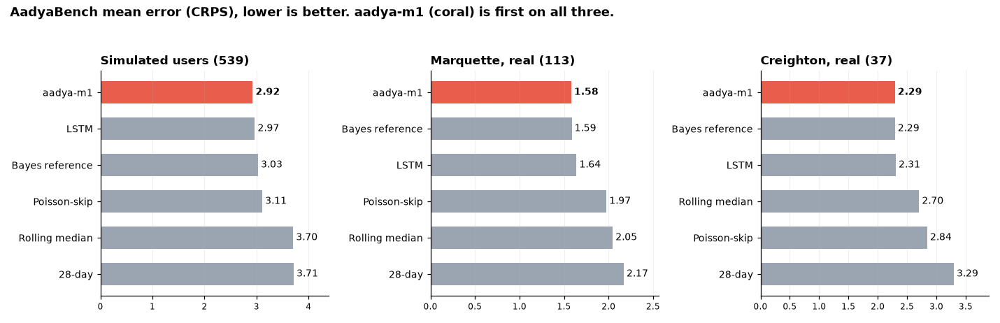
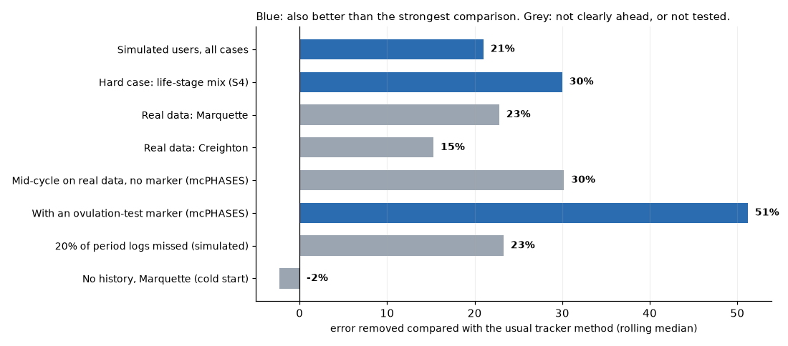
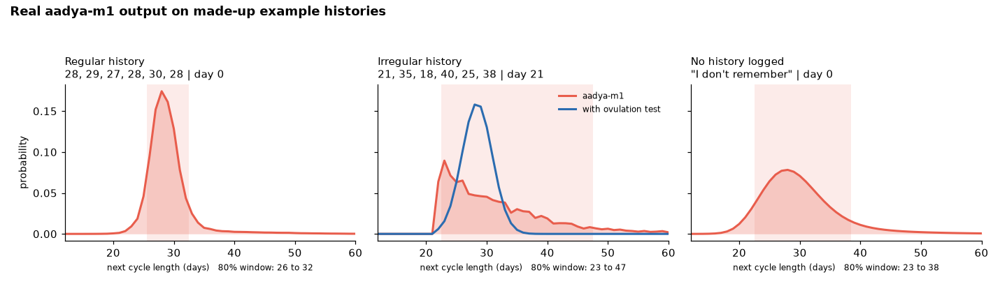

  

  
  
  
  

# Aadya

Open, privacy-first forecasting of when the next period is likely to start, expressed as a probability distribution instead of a single date.

- **Model:** [aadya-m1 on Hugging Face](https://huggingface.co/manasdutta04/aadya-m1)
- **This repository** is for the community: bug reports, ideas, and new forecasting methods that follow the interface in [`forecaster_template.py`](forecaster_template.py).

Not a medical device. It does not diagnose, and it makes no contraception or fertility claims.

## Try it in your browser

Run the model in Google Colab, build a fresh test dataset, and check the scores, calibration, missed logs, the optional ovulation-test input and edge cases, with plain matplotlib and pandas charts. No setup, nothing to install.

## How it performs

Mean error (lower is better) on the three public boards. aadya-m1 is first on all three; on the two small real cohorts it is slightly ahead of the classical reference, within noise. The numbers behind each chart are in the [model repo](https://huggingface.co/manasdutta04/aadya-m1/tree/main/benchmarks).

It outputs a probability for every possible cycle length, so an app can show a window instead of one date:

Full tables, method and caveats are on the [model card](https://huggingface.co/manasdutta04/aadya-m1).

## Contribute

Read [CONTRIBUTING.md](CONTRIBUTING.md). In short: keep real people's data out of issues and pull requests, show uncertainty, and keep changes small and focused.

## License

[Apache-2.0](LICENSE)
